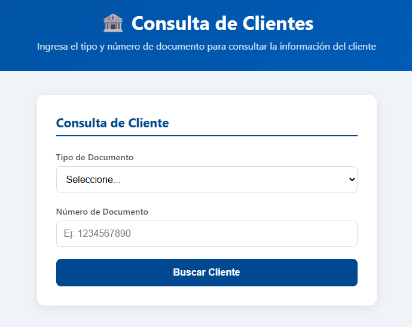
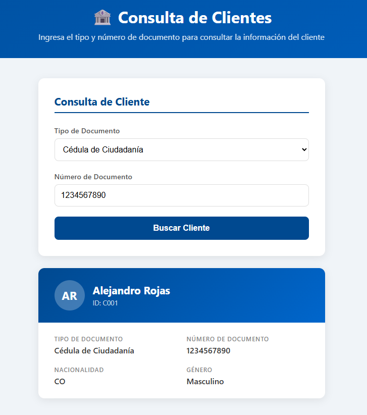
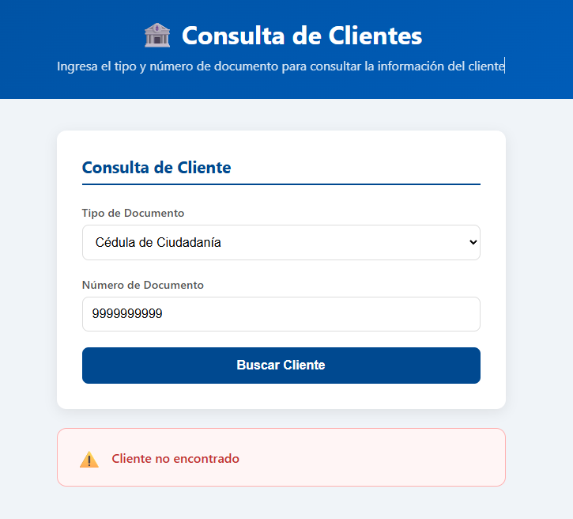

# Prueba Técnica: Consulta de Información de Clientes
## Arquitectura APX + React

---

## 1. Descripción General

Este proyecto implementa un flujo de **Consulta de Información de Clientes** usando la arquitectura APX (Back-end) y React (Front-end). Permite buscar un cliente por tipo y número de documento, y visualizar sus datos en pantalla.

---

## 2. Estructura del Proyecto

```
PruebaAPX/
├── back/
│   └── apx-du-copruecustomerquery/        # Unidad de despliegue APX
│       └── artifact/
│           ├── dtos/
│           │   └── PRUECLB1/              # DTO del cliente
│           ├── libraries/
│           │   ├── PRUERLB1/              # Librería de infraestructura (interfaz)
│           │   ├── PRUERLB1IMPL/          # Librería de infraestructura (implementación)
│           │   ├── PRUERLB2/              # Librería de negocio (interfaz)
│           │   └── PRUERLB2IMPL/          # Librería de negocio (implementación)
│           └── transactions/
│               └── PRUETTR1-01-CO/        # Transacción APX
└── front/
    └── customer-query-app/                # Aplicación React
        └── src/
            ├── components/
            │   ├── SearchForm.js          # Formulario de búsqueda con validaciones
            │   ├── CustomerCard.js        # Tarjeta con datos del cliente
            │   └── Spinner.js             # Indicador de carga
            ├── services/
            │   └── customerService.js     # Consumo de transacción APX
            ├── App.js                     # Componente principal
            └── App.css                    # Estilos
```

---

## 3. Decisiones Técnicas

### Back-end (APX)
- **UUAA:** `PRUE` — identificador del proyecto dentro del ecosistema APX.
- **Arquitectura por capas:** Se siguió el estándar APX separando claramente:
  - **DTO (`PRUECLB1`):** Estructura de datos del cliente sin lógica de negocio. Implementa `Serializable` para compatibilidad con APX.
  - **Librería de Infraestructura (`PRUERLB1`):** Acceso a la base de datos vía utilidad JDBC de APX. Contiene el método `executeGetCustomer` que ejecuta la consulta SQL y mapea el resultado al DTO.
  - **Librería de Negocio (`PRUERLB2`):** Orquesta la llamada a infraestructura, aplica validaciones de entrada y gestiona los códigos de error APX (`addAdvice`).
  - **Transacción (`PRUETTR1-01-CO`):** Único punto de entrada al servicio. Usa los métodos generados automáticamente por APX para obtener parámetros de entrada (`getIdentitydocumenttypeid`, `getIdentitydocumentnumber`) y setear los de salida (`setFirstname`, `setLastname`, etc.).
- **Base de datos:** PostgreSQL 16 simulando datos locales, conectado vía utilidad JDBC de APX.
- **Orden de creación de componentes:** DTOs → Librerías → Transacción. Este orden es obligatorio en APX porque cada componente depende del anterior.

### Front-end (React)
- **Framework:** React — elegido por su agilidad para construir interfaces modulares sin el boilerplate de Angular, cumpliendo el criterio de modularidad exigido en la prueba.
- **Separación de responsabilidades:**
  - `customerService.js` maneja toda la comunicación con APX.
  - `SearchForm.js` maneja el formulario y sus validaciones.
  - `CustomerCard.js` renderiza los datos del cliente.
  - `Spinner.js` muestra el estado de carga.
  - `App.js` orquesta el estado global y el flujo.
- **Mock de API:** Se incluye un mock en `customerService.js` (variable `USE_MOCK = true`) para pruebas locales sin entorno APX activo. Cambiando a `false` se activa la llamada real.

---

## 4. Instrucciones para Ejecutar Localmente

### Requisitos
- Java 8+
- Maven 3+
- APX CLI instalado
- PostgreSQL 16
- Node.js 16+
- npm

### Base de Datos
1. Crear la base de datos en PostgreSQL:
```sql
CREATE DATABASE prue_customers;
```

2. Crear la tabla y datos de prueba:
```sql
CREATE TABLE T_PRUE_CUSTOMER (
    CUSTOMER_ID                 VARCHAR(50)  NOT NULL,
    FIRST_NAME                  VARCHAR(100) NOT NULL,
    LAST_NAME                   VARCHAR(100) NOT NULL,
    NATIONALITY_ID              VARCHAR(50),
    GENDER_ID                   VARCHAR(10),
    IDENTITY_DOCUMENT           VARCHAR(100),
    IDENTITY_DOCUMENT_NUMBER    VARCHAR(50)  NOT NULL,
    IDENTITY_DOCUMENT_TYPE_ID   VARCHAR(50)  NOT NULL,
    PRIMARY KEY (CUSTOMER_ID)
);

INSERT INTO T_PRUE_CUSTOMER VALUES ('C001', 'Alejandro', 'Rojas', 'CO', 'M', 'Cédula de Ciudadanía', '1234567890', 'CC');
INSERT INTO T_PRUE_CUSTOMER VALUES ('C002', 'María', 'González', 'CO', 'F', 'Cédula de Ciudadanía', '0987654321', 'CC');
INSERT INTO T_PRUE_CUSTOMER VALUES ('C003', 'Carlos', 'Martínez', 'CO', 'M', 'Pasaporte', 'AB123456', 'PA');
```

### Back-end (APX)
```bash
cd back/apx-du-copruecustomerquery
mvn clean install
# Levantar el entorno local APX (ENTORNO_LOCAL_APX)
```

### Front-end (React)
```bash
cd front/customer-query-app
npm install
npm start
# Abre http://localhost:3000
```

> **Nota:** El front-end usa un mock de API por defecto (`USE_MOCK = true` en `customerService.js`). Para conectarlo al entorno APX real, cambiar a `USE_MOCK = false`.

---

## 5. Flujo del Sistema

```
[React - SearchForm]
    → usuario ingresa tipo y número de documento
    → validaciones en cliente (campos requeridos, formato)
    → muestra Spinner mientras consulta
        → customerService.js
            → POST /ARQ/REST/v1.0/PRUETTR1-01-CO
                → Transacción APX (PRUETTR1-01-CO)
                    → Librería de Negocio PRUERLB2
                        → valida entradas
                        → llama a Librería de Infraestructura PRUERLB1
                            → JDBC → PostgreSQL
                            → SELECT en T_PRUE_CUSTOMER
                            → retorna CustomerDTO
                    → retorna parámetros de salida
    → renderiza CustomerCard con datos del cliente
    → muestra mensaje de error si no se encuentra
```

---

## 6. Manejo de Errores

| Código | Descripción | Capa |
|--------|-------------|------|
| `PRUE00001` | El tipo de documento es requerido | Negocio |
| `PRUE00002` | El número de documento es requerido | Negocio |
| `PRUE00003` | Cliente no encontrado | Negocio |
| `PRUE00004` | Error al consultar la base de datos | Infraestructura |

---

## 7. Datos de Prueba

| Tipo | Número | Cliente |
|------|--------|---------|
| CC | 1234567890 | Alejandro Rojas |
| CC | 0987654321 | María González |
| PA | AB123456 | Carlos Martínez |

## 8. Capturas de Pantalla

### Formulario vacío


### Card con datos del cliente


### Cliente no encontrado
